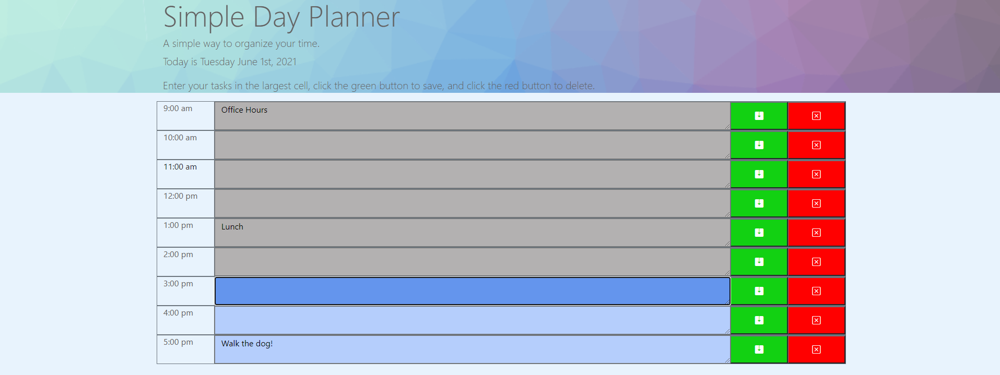

# Simple Day Planner App

This is a simple day planner application created using JavaScript, HTML, and CSS.

I used moment.js to automatically update the date at the top of the page, as well as to automatically change the colours of the textarea cells according to the time of day - light blue for upcoming hours, grey for past hours, and dark blue for the current hour.

Clicking the green save button will save any value entered in the textarea to local storage, which should remain on refresh, and the red button deletes all values.

https://gleeson-emily.github.io/simple-day-planner/